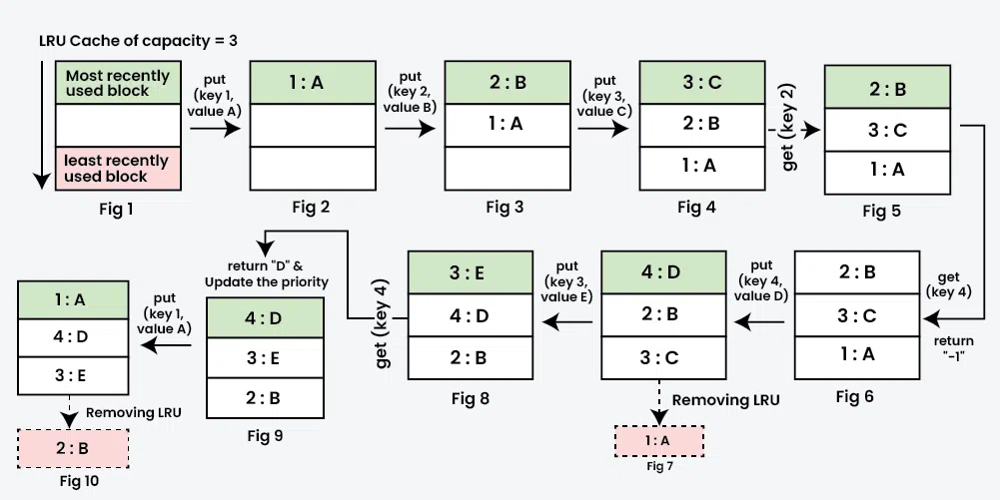

# LRU Cache

## What is it?

LRU (Least Recently Used) Cache is a caching mechanism that stores a limited number of items. When the cache is full and a new item arrives, it removes the least recently used item to make room.

Think of it like a queue:
- When you access data, it moves to the front
- Unused data slowly moves to the back
- When capacity is reached, the back item (least used) gets removed

## How it works
Exlpains preatty well :D 


Other example : 
```
Access: A, B, C, A, D
Queue:  [A, B, C] → [B, C, A] → [B, C, A, D]
```

When accessing A again, it moves to the front. If cache size is 3 and we add D, B gets evicted (it's the oldest).

## In Python

Use `@lru_cache` decorator from `functools`:

```python
from functools import lru_cache

@lru_cache(maxsize=128)
def expensive_function(x):
    return x ** 2
```

- `maxsize=128` - Keep the 128 most recent calls cached
- Same argument → instant return from cache
- Different argument → execute function, cache new result

## When to use it

- Functions called repeatedly with the same arguments
- Expensive operations (API calls, database queries, complex calculations)
- Fibonacci, factorial, currency conversions
- See `lru_cache.py` for working examples