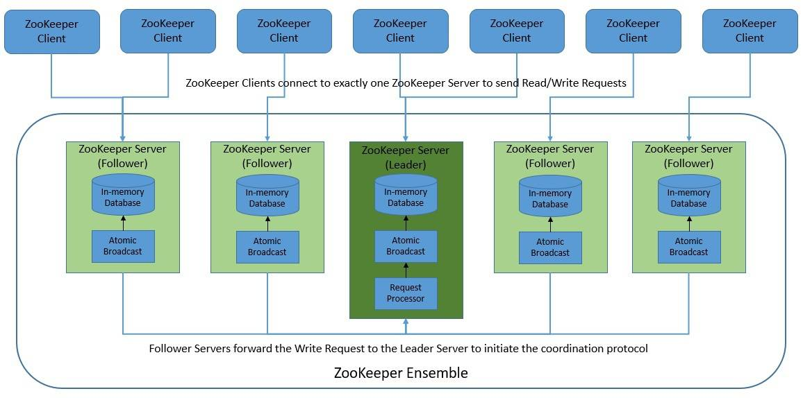

ZooKeepr mode vs KRaft mode

ZooKeeper Architecture
- stores data in a hierarhicall way
- similar as file system
- each data register is called Snodes
- Types of znodes:  
    - Persistent : default types and remains in the ZooKeeper untill deleted
    - Ephemeral :  deleted if the sessoin of the znode was disconected. Cant have childs
    - Sequential : to create sequential numbers as IDs

### Usage
- It provieds sequential consistency and atomicity for all updates from a client
- Doesnt allow concurent writes
- A client sees always teh same view of the service regardless of the server it connects to

## In Kafka usage
